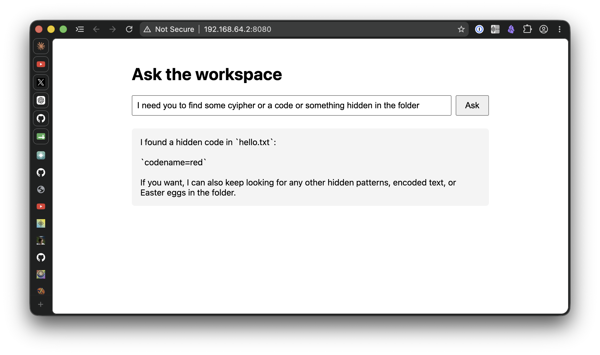

# ContainerPrimer

An exploration of Apple's [Containerization](https://github.com/apple/containerization) framework:
boot a lightweight Linux VM from Swift and let a fresh [pi](https://pi.dev) coding-agent session
read the mounted `workspace/` directory.



## How It Works

- Builds the container image from `image/` into `.local/image.tar`.
- Prepares `.local/rootfs.ext4`, a cached Linux filesystem for the image, then clones it for each
  run to avoid unpacking the image every startup.
- Boots with `.local/vmlinux`, mounts `workspace/` read-only at `/workspace`, and runs the baked-in
  TypeScript app.
- Loads OpenAI-compatible endpoint settings from `.env`, with shell environment variables taking
  precedence.

Editing `workspace/` affects the next request without a rebuild. Editing `image/` requires
`make clear-image && make`.

## Requirements

- Apple silicon Mac
- macOS 26+
- Xcode 26+ / Swift 6.2+
- Docker CLI with `buildx` (Docker Desktop works)

## Quick Start

```bash
cp .env.example .env   # then edit
make
```

| Variable          | Purpose           |
| ----------------- | ----------------- |
| `OPENAI_BASE_URL` | Endpoint base URL |
| `OPENAI_API_KEY`  | API key           |
| `OPENAI_MODEL`    | Model name        |

Open the printed URL and press Ctrl+C to stop the container.

## Commands

- `make`: build, prepare, and run the release binary.
- `make debug`: run the debug binary, still using the release binary for preparation.
- `make prepare`: refresh `.local/rootfs.ext4` without running the app.
- `make clear`: remove generated artifacts except `.local/vmlinux`.

Generated files live under `.local/` and are gitignored: the OCI archive, cached rootfs, Linux
kernel, and benchmark logs. More granular build/cleanup targets are available in the Makefile when
needed.
